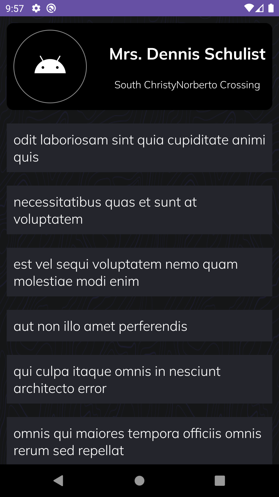
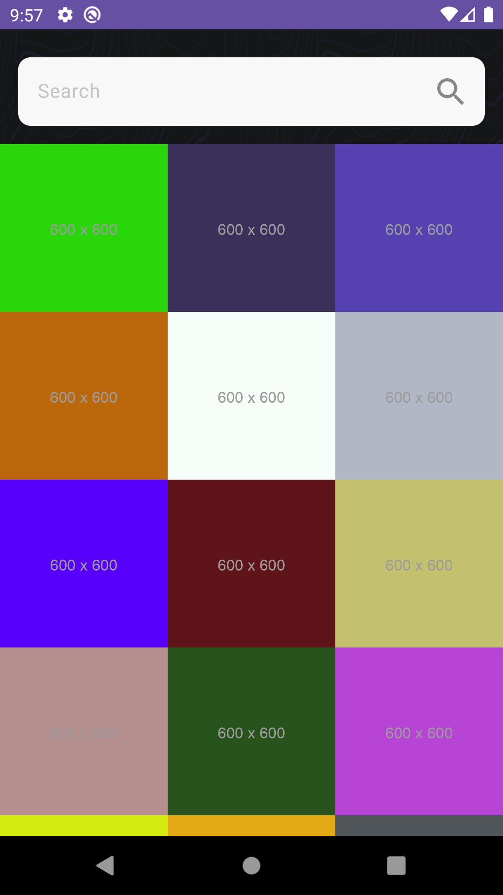
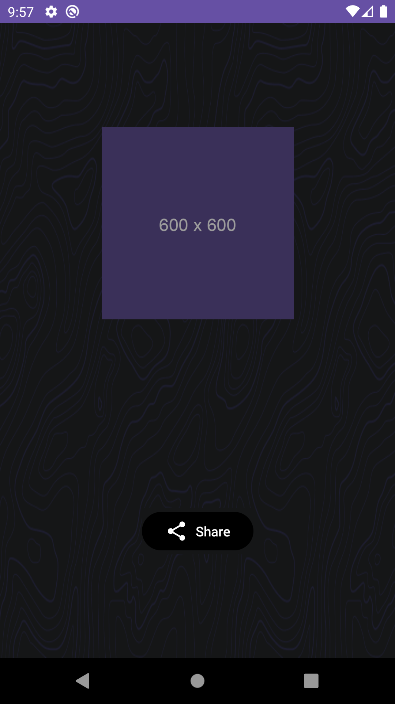
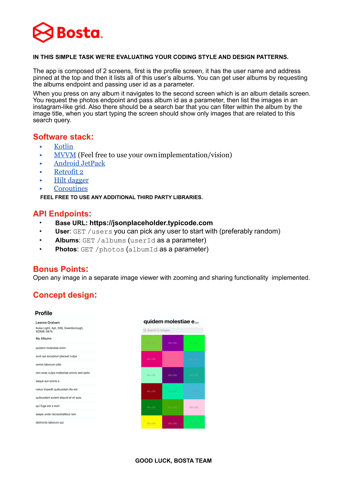

# BostaTask

  

<h1 align="center">Bosta Android Task</h1>

Android Coding Task For Bosta Company | Position: Android Engineer 

## Tech Stacks

- <b>MVVM Architecture:</b> The Arch promotes reusability of code, greatly simplifying the process of creating simple user interfaces
- <b>Jetpack Compose:</b> Used Modern Tech of Jetpack Compose.
- <b>Hilt:</b> Used hilt for Dependency Injection
- <b>Retrofit:</b> Used fetch info from server.

## Screenshots

|                   Main Screen                        |                   Search Screen                    |                     
|:----------------------------------------------------:|:--------------------------------------------------:|
|                 |                  |
|                  Share Screen                        |  
|                      |                     
   
## Task Description 

|                   Task Description                   |                     
|:----------------------------------------------------:|
|                |   

## Demo
[Demo](https://github.com/ahmedelshaikh20/bosta-task/assets/61388151/5069808f-e6a7-469c-a32b-a4d16cab5e81)

